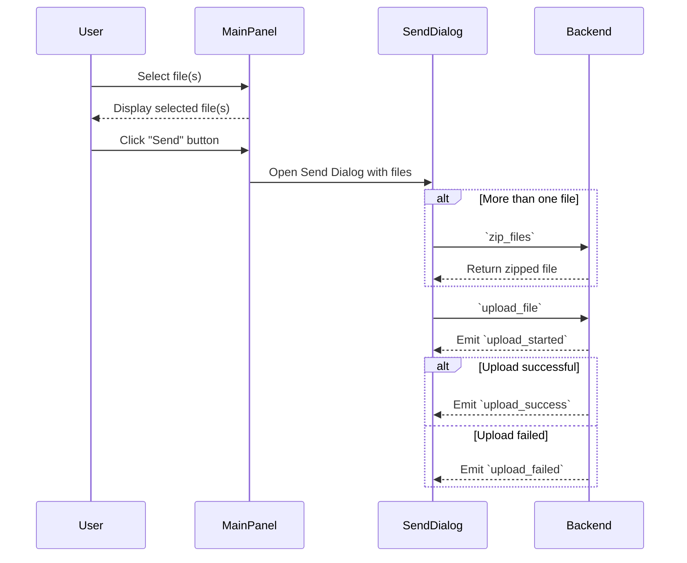
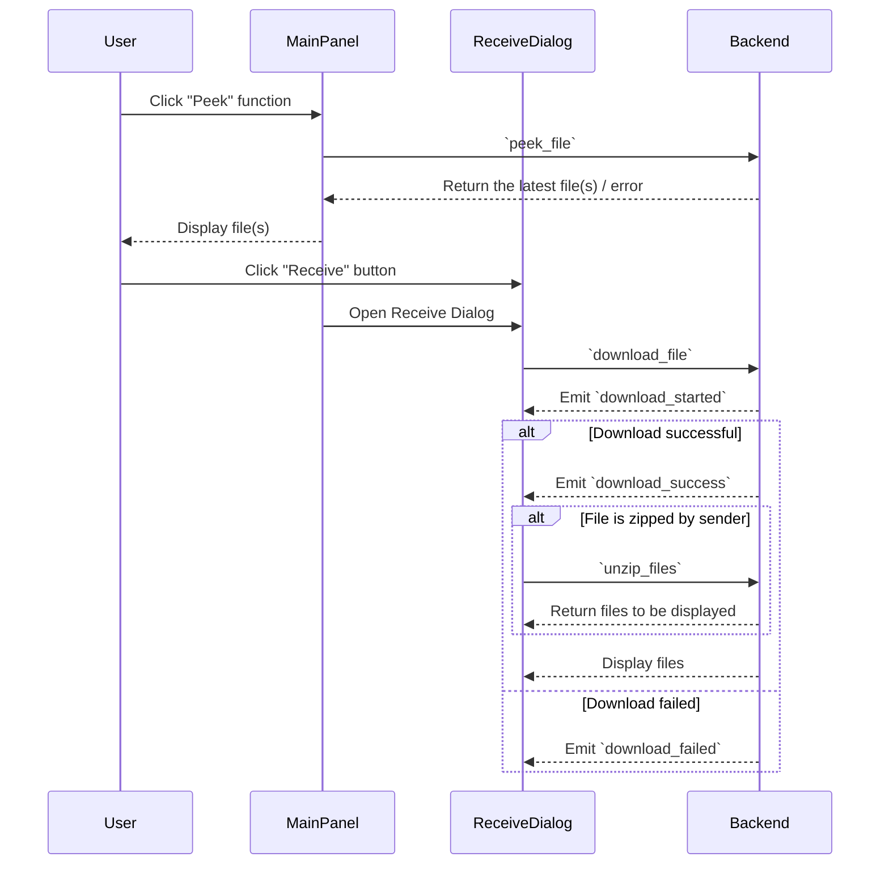

## Development Status
Finished:
- Send ONE file;
- Receive ONE file;
- Modify settings;
- Open received files or open its directory;
- Auto start;
- Dark/Light mode;
- Send texts;
- Send multiple files(zip/unzip);
---
  Issues:
- Auto start not working;
---
  To-do:
- Refactor code;
- Drag and drop support;
---
Future:
- Support Android / iOS;
- Keyboard shortcuts;

--- 
sequence diagram for sending/receiving files:

